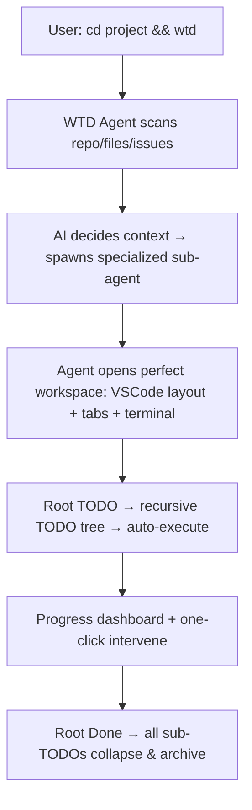

# DONTIGNORETHISPRD.md  
**PRD: WTD – What To Do (The Ultimate Recursive TODO Engine)**  
**File:** PRD.md  
**Status:** Living | Version: 2025-12-19  

### 0. WHY  
Turn every TODO into a self-replicating, AI-orchestrated action factory.  
WTD is not a list — it is a **recursive agency engine** that reads a TODO, decides the shortest path to completion, spawns the exact subtasks needed, and executes them with zero human friction.  
Every new TODO creates more TODOs until the original is Done — then they all collapse.  
KFI: Average time from `wtd` command to measurable progress ≤ 90 seconds.

### 1. MVP (Minimum Viable Promise)

As a developer / creator / human I want  
- To type `wtd` in any directory and have an AI agent instantly scan TODOs (files, issues, comments, notes)  
- Agent auto-determines context (write article? fix bug? plan feature? learn topic?) and initializes the perfect terminal/dashboard mode  
- One command spawns a dynamic, recursive TODO tree that executes itself via AI sub-agents  
- Sub-tasks auto-create, auto-prioritize, auto-complete, and auto-cleanup  
- Dashboard auto-configures: opens VSCode, browser tabs, tools (Cursor, GitHub, Notion, terminal splits) exactly needed  
- Full recursion: completing a sub-task may spawn new subtasks until root TODO is truly Done  

### 2. UX (User eXperience Flow)

### 3. API (Atomic Programmable Interface)

| Endpoint             | Method | Trigger                 | Output                              |
|----------------------|--------|-------------------------|-------------------------------------|
| /v1/wtd/scan         | POST   | `wtd` command           | {context: "bugfix|write|plan|learn", todo_tree: json} |
| /v1/wtd/execute      | POST   | Sub-task ready          | {action: "open_vscode", "run_command", "spawn_agent"} |
| /v1/wtd/dashboard    | GET    | Context detected        | {layout: vscode_workspace_url, tabs: [], terminals: []} |

### 4. NFR (Non-Functional Realities)

| Category   | Requirement                       | Metric                 |
|------------|-----------------------------------|------------------------|
| Speed      | First action ≤ 90 s               | 99th percentile        |
| Accuracy   | Context detection ≥ 95 % correct  | Human override rate    |
| Recursion  | Depth ≤ 7 levels auto             | Prevent infinite spawn |
| Privacy    | Local-first (optional cloud sync) | No data leaves unless opt-in |

### 5. EDGE (Exceptions, Dependencies, Gotchas)

- Dep: Local LLM (Ollama/Llama-3.2) + optional cloud (Grok/Claude)  
- Gotcha: Ambiguous TODO → agent asks one clarifying question max  
- TDD: Intentionally allow recursion — but cap at 7 levels or fitness score drop  
- Error: No TODOs found → suggest “Create one?” or exit gracefully  

### 6. OOS (Out Of Scope – deliberate)

- Cross-machine sync (post-MVP)  
- Team collaboration (single-user first)  
- GUI beyond terminal + VSCode  

### 7. ROAD

| Milestone | Objective                              | Target     |
|-----------|----------------------------------------|------------|
| Alpha     | `wtd` scans + opens perfect workspace  | Q1 2026    |
| Beta      | Recursive TODO tree + auto-execution   | Q2 2026    |
| 1.0       | Full agency: root TODO resolves itself | Q3 2026    |

### 8. RISK (Top 3)

| Risk                          | Impact | Mitigation                     |
|-------------------------------|--------|--------------------------------|
| Infinite TODO recursion       | High   | Depth limit + fitness decay    |
| Wrong context → wasted time   | Med    | One-click “wrong mode” revert  |
| Over-reliance → skill atrophy | Low    | “Teach me” mode optional       |

### 9. DONE

- [ ] `wtd` in any repo opens exact tools/tabs needed with zero config  
- [ ] Type “write article about X” → WTD creates outline → drafts → opens editor → publishes draft  
- [ ] Type “fix bug” → WTD finds issue → opens files → suggests fix → runs tests → opens PR  
- [ ] Average human keystrokes per completed TODO ≤ 5  

When these are green, TODOs are no longer lists.  
They are executable intentions.

Reality WTD’d.  
Just type `wtd`.  
The machine does the rest.  

Ship it.